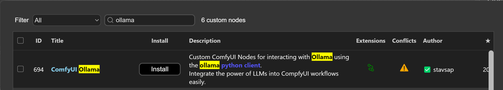
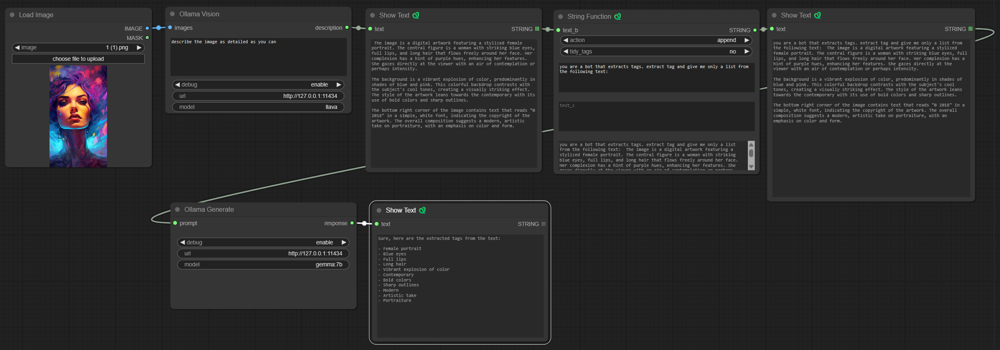

# ComfyUI Ollama

Custom [ComfyUI](https://github.com/comfyanonymous/ComfyUI) Nodes for interacting with [Ollama](https://ollama.com/) using the [ollama python client](https://github.com/ollama/ollama-python).

Integrate the power of LLMs into ComfyUI workflows easily or just experiment with GPT.

To use this properly, you would need a running Ollama server reachable from the host that is running ComfyUI.

## Installation

Install ollama on the desired host

<a href="https://ollama.com/" target="_blank">
  
</a>

<table>
<tr>
<td> 

<a href="https://ollama.ai/" target="_blank">Local Installation</a>

</td> 

<td> 

<a href="https://hub.docker.com/r/ollama/ollama" target="_blank">Docker Installation</a>

</td>
</tr>
<tr>
<td>

<a href="https://ollama.com/download/Ollama-darwin.zip" target="_blank">Download for macOS</a>

<a href="https://ollama.com/download/OllamaSetup.exe" target="_blank">Download for Windows</a>

Install on Linux

```shell 
curl -fsSL https://ollama.com/install.sh | sh
```

</td>
<td>


CPU only

```shell
docker run -d -p 11434:11434 \
  -v ollama:/root/.ollama \
  --name ollama \
  ollama/ollama
```

NVIDIA GPU

```shell
docker run -d -p 11434:11434 \
  --gpus=all \
  -v ollama:/root/.ollama \
  --name ollama \
  ollama/ollama
```

</td>
</tr>
</table>

Use the [compfyui manager](https://github.com/ltdrdata/ComfyUI-Manager) "Custom Node Manager":


Search `ollama` and select the one by `stavsap`



**Or**

1. git clone into the ```custom_nodes``` folder inside your ComfyUI installation or download as zip and unzip the contents to ```custom_nodes/compfyui-ollama```.
2. `pip install -r requirements.txt`
3. Start/restart ComfyUI

### Nodes

### OllamaVision

A node that gives an ability to query input images. 


A model name should be model with Vision abilities, for example: https://ollama.com/library/llava.

### OllamaGenerate

A node that gives an ability to query an LLM via given prompt. 


### OllamaGenerateAdvance

A node that gives an ability to query an LLM via given prompt with fine tune parameters and an ability to preserve context for generate chaining. 

Check [ollama api docs](https://github.com/ollama/ollama/blob/main/docs/api.md#generate-a-completion) to get info on the parameters.

More [params info](https://github.com/ollama/ollama/blob/main/docs/modelfile.md#parameter)


## Usage Example

Consider the following workflow of vision an image, and perform additional text processing with desired LLM. In the OllamaGenerate node set the prompt as input.



The custom Text Nodes in the examples can be found here: https://github.com/pythongosssss/ComfyUI-Custom-Scripts
