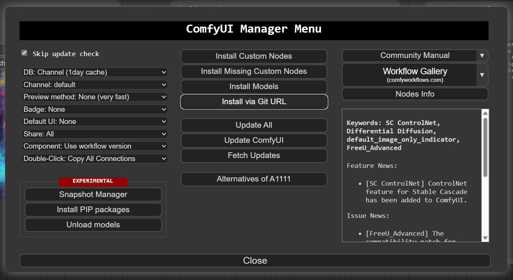

# ComfyUI Ollama

Custom ComfyUI Nodes for interacting with [Ollama](https://ollama.com/) using the [ollama python client](https://github.com/ollama/ollama-python).

Integrate the power of LLMs into CompfyUI workflows easily.

## Installation

1. Install [ComfyUI](https://github.com/comfyanonymous/ComfyUI)
2. git clone in the ```custom_nodes``` folder inside your ComfyUI installation or download as zip and unzip the contents to ```custom_nodes/compfyui-ollama```.
3. Start/restart ComfyUI

**Or** 

use the [compfyui manager](https://github.com/ltdrdata/ComfyUI-Manager) "install via git url".



### Nodes

### OllamaVision

A node that gives an ability to query input images. 


A model name should be model with Vision abilities, for example: https://ollama.com/library/llava.

### OllamaGenerate

A node that gives an ability to query an LLM via given prompt.


