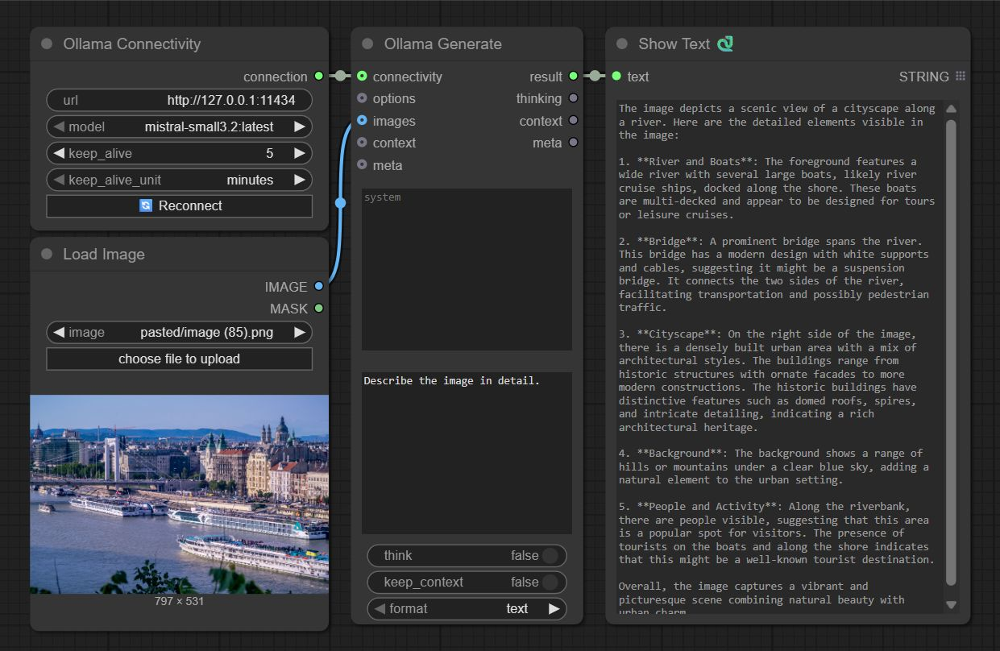

# ComfyUI Ollama

Custom [ComfyUI](https://github.com/comfyanonymous/ComfyUI) Nodes for interacting with [Ollama](https://ollama.com/) using the [ollama python client](https://github.com/ollama/ollama-python).

Integrate the power of LLMs into ComfyUI workflows easily or just experiment with LLM inference.

To use this properly, you would need a running Ollama server reachable from the host that is running ComfyUI.

<a href="https://www.buymeacoffee.com/stavsapq" target="_blank"></a>



## Installation

### 1. Install ollama server on the desired host

<a href="https://ollama.com/" target="_blank">
  
</a>

<details>
<summary><b>Instructions</b></summary>

<a href="https://ollama.com/download/Ollama-darwin.zip" target="_blank">Download for macOS</a>

<a href="https://ollama.com/download/OllamaSetup.exe" target="_blank">Download for Windows</a>

Install on Linux

```shell
curl -fsSL https://ollama.com/install.sh | sh
```

<a href="https://hub.docker.com/r/ollama/ollama" target="_blank">Docker Installation</a>

CPU only

```shell
docker run -d -p 11434:11434 -v ollama:/root/.ollama --name ollama ollama/ollama
```

NVIDIA GPU

```shell
docker run -d -p 11434:11434 --gpus=all -v ollama:/root/.ollama --name ollama  ollama/ollama
```

</details>

### 2. Install the custom nodes

Use ComfyUI's built-in extension manager to install the nodes. Search for `comfyui-ollama` by `Stav Sapir`.

**Or**

If you prefer [ComfyUI-Manager](https://github.com/ltdrdata/ComfyUI-Manager), search for `ollama` and select the one by `stavsap`


**Or**

1. git clone into the `custom_nodes` folder inside your ComfyUI installation or download as zip and unzip the contents to `custom_nodes/compfyui-ollama`.
2. `pip install -r requirements.txt`
3. Start/restart ComfyUI

## Nodes

### OllamaGenerate

A node that provides ability to set the system prompt and the prompt.

Ability to save context locally in the node `enable/disable`

Inputs:

- **OllamaConnectivity** (optional)
- **OllamaOptions** (optional)
- **images** (optional)
- **context** (optional), a context from other OllamaConnectivity
- **meta** (optional), passing metadata of the OllamaConnectivity and OllamaOptions from other OllamaGenerate node.

**Notes:**

- For this node to be operational, **OllamaConnectivity** or **meta** must be inputted!.
- If **images** are inputted and a chain of **meta** usage is made, all the **images** need to be passed as well to the next **OllamaConnectivity** nodes.

### OllamaConnectivity

A node responsible only fot the connectivity to the ollama server

### OllamaOptions

A node for full control of the ollama api options.

For an option to take effect, each option have also `enable/disable`, enabled options are passed to api call to ollama server.

Ollama API options can be found in [this table](https://github.com/ollama/ollama/blob/main/docs/modelfile.md#valid-parameters-and-values).

**Note**: There is an additional option `debug` that enables debug print in the cli, its not part of ollama api.

### Deprecated nodes

Old V1 nodes are still available, please replace them with the above ones. Here's the [documentation of V1](V1_nodes.md) nodes.

## Usage Example

Please see the `example_workflows` folder or use ComfyUI's template browser.

The custom Text Nodes in the examples can be found here: https://github.com/pythongosssss/ComfyUI-Custom-Scripts
