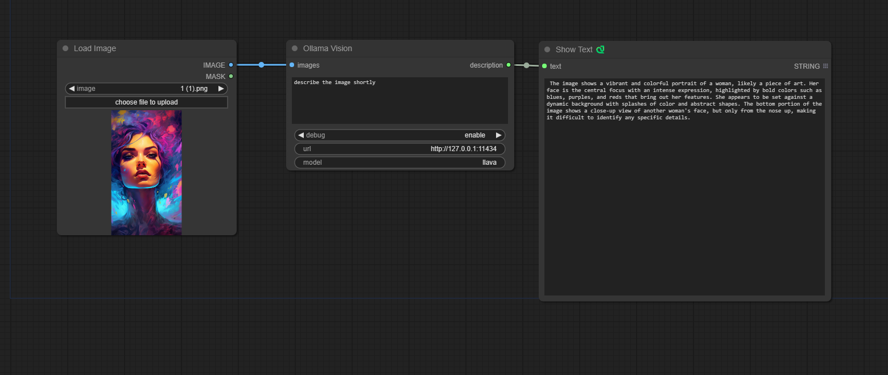
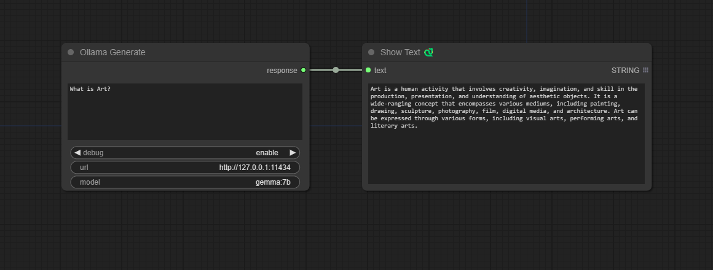
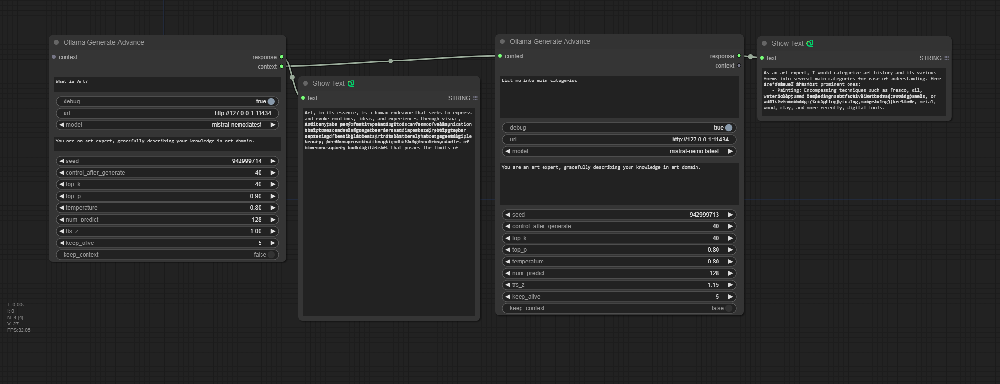

## V1 Release

These nodes are deprecated, please replace them in your workflows.

### OllamaVision

A node that gives an ability to query input images.

A model name should be model with Vision abilities, for example: https://ollama.com/library/llava.

### OllamaGenerate

A node that gives an ability to query an LLM via given prompt.

### OllamaGenerateAdvance

A node that gives an ability to query an LLM via given prompt with fine tune parameters and an ability to preserve context for generate chaining.

Check [ollama api docs](https://github.com/ollama/ollama/blob/main/docs/api.md#generate-a-completion) to get info on the parameters.

More [params info](https://github.com/ollama/ollama/blob/main/docs/modelfile.md#parameter)

